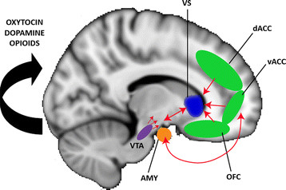
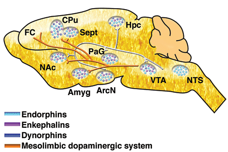

```{r setup, include=FALSE}
knitr::opts_chunk$set(echo = FALSE, warning = FALSE, 
                      message = FALSE,
                      fig.align = "center",
                      out.width = "700px")
```

# Fun

<iframe width="420" height="315" src="https://www.youtube.com/embed/vJTxzsHsako" frameborder="0" allowfullscreen></iframe>

# Fear

## Animal models

```{r}
knitr::include_graphics("img/ledoux-lab-fear_conditioning.jpg")
```

<small>
<http://www.cns.nyu.edu/labs/ledouxlab/images/image_research/fear_conditioning.jpg>
</small>

<iframe width="560" height="315" src="https://www.youtube.com/embed/ZlZekx1P1g4" frameborder="0" allow="accelerometer; autoplay; encrypted-media; gyroscope; picture-in-picture" allowfullscreen></iframe>

```{r, fig.cap="Adapted from [[@davis1992role]](http://dx.doi.org/10.1016/0165-6147(92)90014-W)"}
knitr::include_graphics("img/davis-anxiety-rat-vs-human.jpg")
```

## Amygdala circuits

```{r, fig.cap="[[@medina2002parallels]](http://dx.doi.org/10.1038/nrn728)"}
knitr::include_graphics("img/fear-conditioning-amygdala-nrn728-f2.gif")
```

- Direct (fast) pathways via thalamus
- Indirect (slower) pathways via cortex
- Input and output (behavior, physiology) specificity

## Specificity of learning stimulus/response mappings

```{r, fig.cap="[[@Pellman2016-xu]](https://doi.org/10.1016/j.tins.2016.04.001)"}
knitr::include_graphics("https://ars.els-cdn.com/content/image/1-s2.0-S0166223616300017-gr1.jpg")
```

- Specific stimulus/response, $S \rightarrow R$, patterns
- Visual OR Auditory $\rightarrow$ pain
- Taste $\rightarrow$ nausea

## Circuitry

```{r, fig.cap="[[@Brandao2008-hw]](http://dx.doi.org/10.1016/j.bbr.2007.10.018)"}
knitr::include_graphics("https://ars.els-cdn.com/content/image/1-s2.0-S0166432807005633-gr1.jpg")
```

```{r, fig.cap="[[@Pellman2016-xu]](https://doi.org/10.1016/j.tins.2016.04.001)"}
knitr::include_graphics("https://ars.els-cdn.com/content/image/1-s2.0-S0166223616300017-gr2.jpg")
```

- BLA, basolateral complex of the amygdala
- CEA, central nucleus of the amygdala
- ITC, intercalated cells of the amygdala
- PL, prelimbic cortex
- IL, infralimbic cortex
- HPC, hippocampus
- Thal, thalamus
- PAG, periaqueductal gray
- PBN, parabrachial nucleus

# Stress types

- **Acute** stress
    + Short duration
- Brain detects threat
- Mobilizes physiological, behavioral responses
    + HPA (Cortisol), SAM (NE/Epi) axes
- vs. **Chronic** or stress
    + Long duration, persistent
    
## Glucocorticoids

- Adrenal cortex releases hormones
+ Cortisol (hydrocortisone)
    * Increases blood glucose levels
    * Suppresses immune system
    * Reduces inflammation
    * Aids in metabolism
+ Receptors in body and brain
    
```{r, fig.cap="[[@Kadmiel2013-zz]](10.1016/j.tips.2013.07.003)"}
knitr::include_graphics("https://www.cell.com/cms/attachment/2007960795/2030644348/gr4.jpg")
```

- Multiple feedback loops

```{r, fig.cap="http://www.molecularbrain.com/content/figures/1756-6606-3-2-1-l.jpg"}
knitr::include_graphics("img/cortisol-molecular-brain.jpg")
```

## Impacts of acute stress

```{r, fig.cap="[[@Musazzi2017-lr]](https://doi.org/10.1016/j.tins.2017.07.002)"}
knitr::include_graphics("https://ars.els-cdn.com/content/image/1-s2.0-S0166223617301364-gr1_lrg.jpg")
```

```{r, fig.cap="[[@Musazzi2017-lr]](https://doi.org/10.1016/j.tins.2017.07.002)"}
knitr::include_graphics("https://ars.els-cdn.com/content/image/1-s2.0-S0166223617301364-gr3.jpg")
```

### Changes in neural architecture

- Hippocampus (rich in CORT receptors)
- Prefrontal cortex

### Neurochemical factors

- Cortisol enhances glutamate release
- Corticosteroid antagonists block this
- Ketamine (NMDA receptor antagonist) may act via similar mechanisms

```{r, fig.cap="Sapolsky, *Why Zebras Don't Get Ulcers*"}
knitr::include_graphics("https://prodimage.images-bn.com/pimages/9780805073690_p0_v2_s550x406.jpg")
```

# Pleasure/reward

## Neuroanatomy of 'pleasure'

```{r, fig.cap="[[@kringelbach2009towards]](http://dx.doi.org/10.1016/j.tics.2009.08.006)"}
knitr::include_graphics("img/kringelbach-2009-fig-2.jpg")
```

## Reward

- A *reward* reinforces (makes more prevalent/probable) some behavior
- Milner and Olds [[@milner_discovery_1989]](http://doi.org/10.1016/S0149-7634(89)80013-2) discovered 'rewarding' power of electrical self-stimulation
- [[@heath1963electrical]](http://doi.org/10.1176/ajp.120.6.571) studied effects in human patients.

## Electrical self-stimulation

<iframe width="640" height="480" src="https://www.youtube.com/embed/de_b7k9kQp0" frameborder="0" allowfullscreen></iframe>

## "Reward" circuitry in the brain

```{r, fig.cap="[[@nestler2006mesolimbic]](http://dx.doi.org/10.1016/j.biopsych.2005.09.018)"}
knitr::include_graphics("img/nestler-fig-1.jpg")
```

- Lateral Hypothalamus (Hyp)
- Medial forebrain bundle (MFB)
- Ventral tegmental area (VTA) in midbrain
- Nucleus accumbens (nAcc)
- Dorsal Raphe Nucleus/Locus Coeruleus (DR/LC)
- Amygdala (Amy)
- Hippocampus (HP)
- Prefrontal cortex (PFC)

```{r, fig.cap="[[@kohls2012social]](http://dx.doi.org/10.1186/1866-1955-4-10)"}

```

## What does DA signal?

- Hedonia and anhedonia
- Incentive salience
- Reward prediction error (RPE)

```{r, fig.cap="[[@Hu2016-yw]](https://doi.org/10.1146/annurev-neuro-070815-014106)"}
knitr::include_graphics("http://www.annualreviews.org/na101/home/literatum/publisher/ar/journals/content/neuro/2016/neuro.2016.39.issue-1/annurev-neuro-070815-014106/20160711/images/large/ne390297.f1.jpeg")
```

DA and GABA signaling

```{r, fig.cap="[[@Watabe-Uchida2017-gi]](https://doi.org/10.1146/annurev-neuro-072116-031109)"}
knitr::include_graphics("http://www.annualreviews.org/na101/home/literatum/publisher/ar/journals/content/neuro/2017/neuro.2017.40.issue-1/annurev-neuro-072116-031109/20170719/images/large/ne400373.f1.jpeg")
```

Expectation modulates DA signaling

```{r, fig.cap="[[@Watabe-Uchida2017-gi]](https://doi.org/10.1146/annurev-neuro-072116-031109)"}
knitr::include_graphics("http://www.annualreviews.org/na101/home/literatum/publisher/ar/journals/content/neuro/2017/neuro.2017.40.issue-1/annurev-neuro-072116-031109/20170719/images/large/ne400373.f2.jpeg")
```

DA network

```{r, fig.cap="[[@Watabe-Uchida2017-gi]](https://doi.org/10.1146/annurev-neuro-072116-031109)"}
knitr::include_graphics("http://www.annualreviews.org/na101/home/literatum/publisher/ar/journals/content/neuro/2017/neuro.2017.40.issue-1/annurev-neuro-072116-031109/20170719/images/large/ne400373.f4.jpeg")
```

```{r, fig.cap="[[@Watabe-Uchida2017-gi]](https://doi.org/10.1146/annurev-neuro-072116-031109)"}
knitr::include_graphics("img/watanabe-Uchida-fig-4-cap.jpg")
```

Reward & Aversion Networks

```{r, fig.cap="[[@Watabe-Uchida2017-gi]](https://doi.org/10.1146/annurev-neuro-072116-031109)"}
knitr::include_graphics("http://www.annualreviews.org/na101/home/literatum/publisher/ar/journals/content/neuro/2016/neuro.2016.39.issue-1/annurev-neuro-070815-014106/20160711/images/large/ne390297.f3.jpeg")
```

## Psychopharmacology of pleasure

- Dopamine
- Serotonin, Norepinephrine
- ACh

```{r, fig.cap="[[@cock_sleep_2008]](http://dx.doi.org/10.1038/ncpneuro0775)"}
knitr::include_graphics("img/ncpneuro0775-f4.jpg")
```

<div class="centered">


[[@cock_sleep_2008]](http://dx.doi.org/10.1038/ncpneuro0775)
</div>

- Opioids, endogenous morphine-like NTs (endorphins)

```{r, fig.cap="[[@clapp-niaa]](http://pubs.niaaa.nih.gov/publications/arh314/310-339.htm)"}

```

- Cannabinoids = psychoactive compounds found in cannibis
- Endocannabinoids (endogenous cannabinoid system)
    - Cannabinoid CB1 receptors in CNS; CB2 in body, immune system

```{r, fig.cap="[[@flores_cannabinoid-hypocretin_2013]](http://dx.doi.org/10.3389/fnins.2013.00256)"}
knitr::include_graphics("img/fnins-07-00256-g001.jpg")
```

# References
