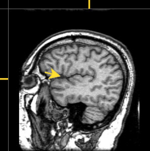

1. The image illustrates what type of slice?  
**A. Sagittal.**  
B. Dorsal. (not a type of slice)  
C. Coronal.(slices are symmetric)  
D. Axial. (slices are symmetric)  

2. All of the following structures can be seen in the figure EXCEPT  
A. White matter. 
B. Gray matter. 
C. **Lateral ventricles**. (CSF would appear dark; often hard to see in lateral view)  
D. Cerebral cortex. 

3. The figure illustrates the use of \_\_\_ magnetic resonance imaging, a technique with \_\_\_ spatial resolution. 
A. functional; fair (∼ 3+ mm). (low spatial resolution, often depicted with color-coded activity maps) 
B. **structural; good (∼ 1 mm)**.  
C. neural; excellent (∼ 1 micron). (not a type of MRI) 
D. diffusion tensor; poor (∼ 1 cm) (fiber pathways not shown). 

4. This structure in the midbrain was where Descartes believed the soul influenced movements of the body. 
A. superior colliculus. (in midbrain, but not part of Descartes' thinking) 
B. pons. (not in midbrain.) 
C. amygdala. (not in midbrain.) 
D. **pineal gland**. 

5. Event-related potentials (ERPs) are detected using... 
A. positron emission tomography (PET); local metabolic rates. (ERPs ≠ PET) 
B. magnetic resonance imaging (MRI); the integrity of white matter fiber tracts. (MRI ≠PET) 
C. **electroencephalography (EEG); the time-locked electrical activity of large numbers of neurons**. 
D. magnetoencephalography (MEG); average brain magnetic activity. (ERPs usually measure electrical activity) 

6. In the cerebral cortex, the lateral fissure is \_\_\_ to the longitudinal fissure.  
A. posterior. (longitudinal and lateral fissures are roughly parallel to rostral/caudal axis) 
B. anterior. (longitudinal and lateral fissures are roughly parallel to rostral/caudal axis) 
C. rostral. (longitudinal and lateral fissures are roughly parallel to rostral/caudal axis) 
D. **inferior**. 

7. The space between the arachnoid membrane and the pia mater of the meninges is filled with a fluid substance called \_\_\_. 
A. brain plasma. (incorrect term) 
B. interstitial fluid. (possible answer, but there's a better, more precise one) 
C. **cerebro-spinal fluid**. 
D. cerebellar-spacing flux. (made-up term) 

8. All of these structures are components of the midbrain EXCEPT:  
A. superior colliculus. 
B. **3rd ventricle**. (associated with diencephalon)  
C. tegmentum. 
D. inferior colliculus. 

9. Why does fMRI represent an *indirect* measure of brain activity? 
A. It measures brain structure, not function. (not *f*MRI) 
B. It measures electrical activity, but neurons send chemical messages. (sounds like EEG.) 
C. **It measures changes in blood oxygen and blood flow that follow neural activity**. 
D. It has poor spatial resolution. (true, but not why it is an indirect measure) 

10. Anterograde and retrograde histochemical cell tracers help neuroscientists determine \_\_\_.  
A. what stimuli best activate a brain region. (structural vs. functional methods) 
B. **what connects where**. 
C. when to stimulate a brain region for maximum effect. (structural vs. functional methods) 
D. whether a brain area is functioning normally. (structural vs. functional methods) 

BONUS QUESTIONS

11. This forebrain structure in the ventral diencephalon controls both the autonomic nervous system and the endocrine system. 
A. Hippocampus. (not in diencephalon; associated with semantic memory) 
B. Thalamus. (in diencephalon, but not with ANS) 
C. Medulla. (in hindbrain, not diencephalon) 
D. **Hypothalamus**. 

12. The arrow in Figure 1 points to a fissure in the cerebral cortex called the \_\_\_. 
A. **lateral fissure**. 
B. superior longitudinal fissure. (not visible from this sagittal view) 
C. calcarine fissure. (in occipital lobe; not emphasized in this course) 
D. Rolandic fissure. (less common name for central sulcus) 